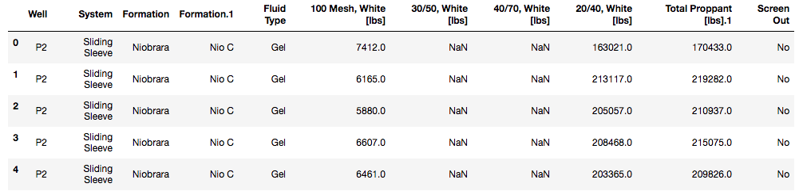

## What computers can do for your oil & gas data that humans cannot

We often design hydraulic fracturing treatments around historical success. We look to the successes (and failures) of "[wildcatters](https://en.wikipedia.org/wiki/Wildcatter)" of the past and replicate treatment designs. Once we have a baseline treatment that tends to perform within a formation, we strive for continuous improvement, adjusting our baseline treatment in  controlled ways, evaluating the efficacy of our adjustments. Said experiments are conducted by scientists, engineers, and statisticians in the lab and field with tools such as Excel, SpotFire, proprietary simulation software, and various programming languages. However, the full power of data is just beginning to be leveraged industry-wide, for two reasons:

1. Good datasets take time to accumulate.
2. The emergence of open-source tools (like [Python](https://www.python.org/) and [R](https://www.r-project.org/)) to the forefront of data science and machine learning has leveled the playing field for advanced analytics among startups and supermajors alike.

### Machine Learning — What’s the hype about?
Machine learning and artificial intelligence (AI) have stirred quite a bit of commotion lately, with mainstream news articles referencing Facebook’s chatbot AI being shut down for “[creating its own language](https://www.theatlantic.com/technology/archive/2017/06/artificial-intelligence-develops-its-own-non-human-language/530436/)” and [Elon Musk urging  the to ban UN to ban AI weapons](https://www.theguardian.com/technology/2017/aug/20/elon-musk-killer-robots-experts-outright-ban-lethal-autonomous-weapons-war) to be proactive in controlling AI development.

We’re in an era where the data being collected is allowing engineers to perform machine learning algorithms that learn patterns in data at scale in ways humans can't fathom (e.g. processing 100+ million rows of data, synthesizing data in more than 3 dimensions, combining variables non-linearly). [Robots have been taught to cook](https://www.youtube.com/watch?v=MLJyUmuP6Qg) by watching YouTube and computer vision models can now [diagnose the recurrence of brain cancer](http://neurosciencenews.com/ai-brain-cancer-neurology-5058/) in ways that physicians cannot. So it doesn't seem outrageous that we could generate novel, low-cost frac treatments that have high production potential or use frac van time series data to find pressure patterns that indicate a potential screen out before a seasoned engineer or treater may be able to.

Well Data Labs is enabling leaders in the oil and gas industry to store and navigate their high-frequency data with ease, allowing completions engineers, geologists, and analysts to take the leap into advanced analytics and begin tip-toeing into the world of machine learning.

### How machine learning can be applied in oil & gas?
The realm of machine learning in oil & gas isn't limited to production optimization either. Leaders in the field are predicting field equipment failure from vibrational data, creating [vehicle routing optimization](https://en.wikipedia.org/wiki/Vehicle_routing_problem) algorithms to prioritize which wells pumpers should travel to next, and using [natural language processing](https://blog.algorithmia.com/introduction-natural-language-processing-nlp/) to analyze engineering/treater notes to predict which well sites are  high risk candidates for safety incidents.

Data science is moving the oil & gas industry from being reactive to proactive. But here's the catch -- we need people with oil & gas domain expertise building these algorithms! The oilfield is a complex and nuanced place and building predictive models and developing meaningful statistics is difficult with domain experience. Tools like Tableau will take you far, but if you're looking to elevate your skillset,  programming is a requirement. Python and R are and the languages of data science and machine learning.

### How to get started with data analytics using Python?
Python is programming language. Within Python, are something called [modules](https://docs.python.org/2/tutorial/modules.html). Modules are a composed of code someone has written to make your life easier. For the Excel users out there, imagine having to write a VLOOKUP function with VBA code every time you wanted it’s functionality. Modules make it easy to perform common tasks in a few lines of code and are optimized for computation speed.
Below I write code in Python by interacting with two modules — pandas and seaborn. [Pandas](http://pandas.pydata.org/) is an Excel-like module for big data and enhanced manipulation. [Seaborn](https://seaborn.pydata.org/) is a tool for creating beautiful charts and visuals. If you gain comfort with Python and these modules, machine learning is not far away (look to a module called [scikit-learn](http://scikit-learn.org/stable/) and [this tutorial](http://scikit-learn.org/stable/tutorial/basic/tutorial.html) to get started). Resources to help you get set-up with Python can be found in the **Resources** section below.

Using frac stage data extracted from Well Data Labs, in just a few lines of code I’m able to look at the at the distribution of sand volumes pumped in gel-based treatments across formations. Click [here](code_snippet.md) to see the code!

```python
# import helpful modules
import pandas as pd # pd is an alias we can reference to call pandas in our code
import seaborn as sns

# load the Excel file
xlsx = pd.ExcelFile('FracStats_JobList_Summer2017.xlsx')
# load the selected tab from the Excel workbook into a pandas dataframe
df_frac = xlsx.parse('FracStats')

# print the first five rows of the data frame
print(df_frac.head())
```



```python
# narrow down to stages treated with 'Gel' and not  screened out
df_gel = df_frac.loc[(df_frac['Fluid Type'] == 'Gel') & (df_frac['Screen Out'] == 'No')]

print("{} stages across {} wells.".format(df_gel.shape[0], len(df_gel['Well'].unique())))
```

`590 stages across 22 wells.`

Let's visualize the distribution of proppant pumped in these stages by formation (Niobrara, Codell, Wolfrcamp).

You may be familiar with [box plots](http://www.physics.csbsju.edu/stats/box2.html) (also called box-and-whisker plots). [Violin plots](http://www.datavizcatalogue.com/methods/violin_plot.html) present a distribution in greater detail and allow you took look at details.

```python
# plot the distribution of total sand pumped by formation in a violin plot.
sns.violinplot(data=df_gel, x="Formation", y="Total Proppant [lbs].1")
```


### Wrapping it Up
The barrier of entry to advanced analytics has never been lower. You can use the same analytics tools that are literally used by leading researchers around the world. The amount of data that oil & gas companies collect and high-stakes decisions make the industry one of the most exciting for data science and machine learning.

What tools are you using for data analysis? Try to replicate analysis you’ve done using Python and share your data explorations with the Well Data Labs team at @twitter(?). Some additional resources to getting started with Python can be found below.


### Resources
* D
* Get data s
*
