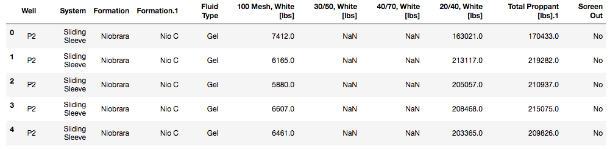
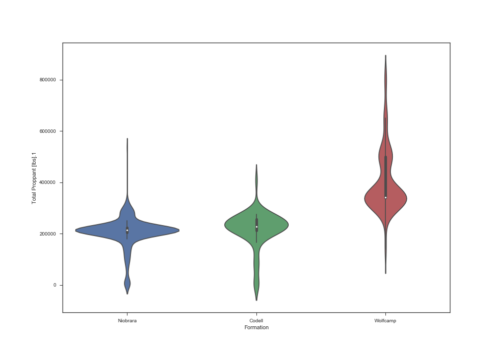

```python
# import helpful modules
import pandas as pd # pd is an alias we can reference to call pandas in our code
import seaborn as sns

# load the Excel file
xlsx = pd.ExcelFile('FracStats_JobList_Summer2017.xlsx')
# load the selected tab from the Excel workbook into a pandas dataframe
df_frac = xlsx.parse('FracStats')

# print the first five rows of the data frame
print(df_frac.head())
```



```python
# narrow down to stages treated with 'Gel' and not  screened out
df_gel = df_frac.loc[(df_frac['Fluid Type'] == 'Gel') & (df_frac['Screen Out'] == 'No')]

print("{} stages across {} wells.".format(df_gel.shape[0], len(df_gel['Well'].unique())))
```

`590 stages across 22 wells.`

Let's visualize the distribution of proppant pumped in these stages by formation (Niobrara, Codell, Wolfrcamp).

You may be familiar with [box plots](http://www.physics.csbsju.edu/stats/box2.html) (also called box-and-whisker plots). [Violin plots](http://www.datavizcatalogue.com/methods/violin_plot.html) present a distribution in greater detail and allow you took look at details.

```python
# plot the distribution of total sand pumped by formation in a violin plot.
sns.violinplot(data=df_gel, x="Formation", y="Total Proppant [lbs].1")
```

